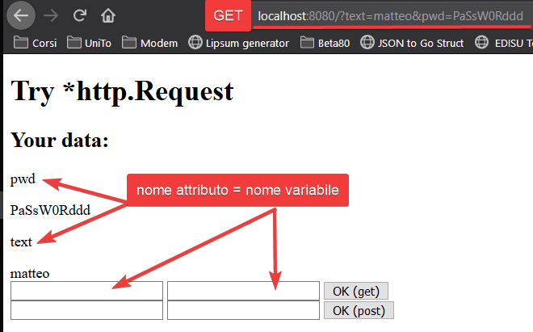

# Readme

## La funzione ListenAndServe

[http.ListenAndServe](https://golang.org/pkg/net/http/#ListenAndServe) permette di ascoltare all'indirizzo `addr`. Ad ogni connessione accettata viene lanciato il metodo dell'handler `utilizzato`.

Ogni chiamata della funzione ListenAndServe porta come parametri

- responseWriter [http.ResponseWriter](https://golang.org/pkg/net/http/#ResponseWriter)
- request [*http.Request](https://golang.org/pkg/net/http/#Request)

### http.ResponseWriter

Implementa l'interfaccia Writer e questo permette di scrivere nella connessione.

### *http.Request

E' un puntatore a struct che contiene tutti i dati sulla richiesta ricevuta, compresi i dati passati tramite form.

## Esplora i dati passati tramite form

Dopo aver chiamato il metodo `request.ParseForm()` si popolano i cambi della request `Form` e `PostForm`.

1. `Form`: contiene tutte le variabili passate tramite **get** e tramite **post**.
2. `PostForm`: contiene solo le variabili passate tramite **post**.

### Template

```Gohtml
<!DOCTYPE html>
<html lang="en">
<head>
	<meta charset="UTF-8">
	<meta name="viewport" content="width=device-width, initial-scale=1.0">
	<meta http-equiv="X-UA-Compatible" content="ie=edge">
	<title>http request in Go</title>
</head>
<body>
	<h1>Try *http.Request</h1>

	{{if .}}
	<h2>Your data:</h2>
	<div>
		{{range $k, $v := .}}
			<p>{{$k}}</p>
			{{range $v}}
				{{.}}<br>
			{{end}}
		{{end}}
	</div>
	{{end}}

	<form action="/" method="GET">
		<input type="text" name="text" id="text">
		<input type="password" name="pwd" id="pwd">
		<input type="submit" value="OK (get)">
	</form>

	<form action="/" method="POST">
		<input type="text" name="text" id="text">
		<input type="password" name="pwd" id="pwd">
		<input type="submit" value="OK (post)">
	</form>
</body>
</html>
```

### Codice

```Go
type myhandler struct{}

func (m myhandler) ServeHTTP(responseWriter http.ResponseWriter, request *http.Request) {
	err := request.ParseForm()
	if err != nil {
		log.Fatal(err)
	}
	tpl.ExecuteTemplate(responseWriter, "maintemplate.gohtml", request.Form)
}

func init() {
	tpl = template.Must(template.New("maintemplate").ParseGlob("*.gohtml"))
}

var tpl *template.Template

func main() {
	fmt.Println("Listening on port :8080")
	var myh myhandler
	err := http.ListenAndServe(":8080", myh)
	if err != nil {
		log.Fatal(err)
	}
}
```

Per esplorare i dati passati tramite Form è necessario chiamare il metodo `request.ParseForm()` che popola detemrinati campi nella response con i dati passati tramite form submit.

Nel form, i campi rappresentati dall'attributo `name` rappresentano i nomi delle variabili che contengono il valore del dato passato.

Nella response viene infatti creata una mappa le cui chiavi hanno il nome del campo `name` del form.

