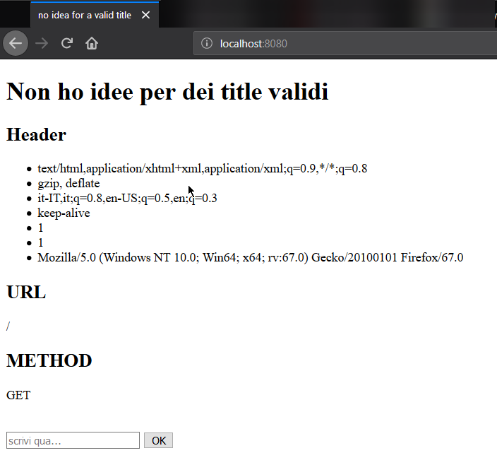
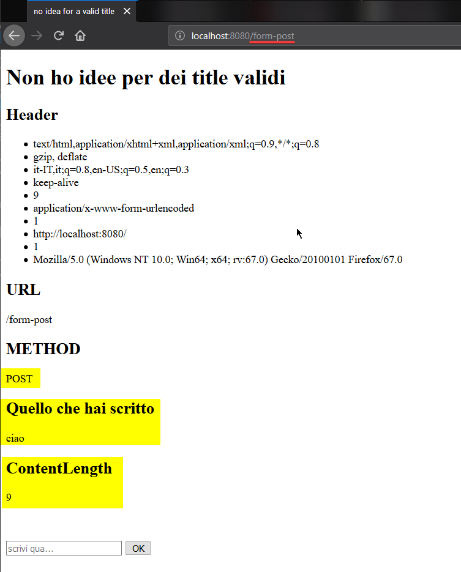

# readme

## *http.Response

### Script

```Go
package main

import (
	"log"
	"net/http"
	"net/url"
	"text/template"
)

type Handler struct{}

func (h Handler) ServeHTTP(response http.ResponseWriter, request *http.Request) {
	err := request.ParseForm()
	if err != nil {
		log.Fatal(err)
	}

	data := struct {
		Header        http.Header
		ContentLength int64
		M             string     // request method
		URL           *url.URL   // request url
		FormData      url.Values // contenuto del form
	}{
		Header:        request.Header,
		ContentLength: request.ContentLength,
		M:             request.Method,
		URL:           request.URL,
		FormData:      request.PostForm,
	}

	err = tpl.ExecuteTemplate(response, "index.gohtml", data)
	if err != nil {
		log.Fatal(err)
	}
}

func init() {
	tpl = template.Must(template.New("").ParseGlob("*.gohtml"))
}

var tpl *template.Template

func main() {
	var handler Handler
	err := http.ListenAndServe(":8080", handler)
	if err != nil {
		log.Fatal(err)
	}
}
```

### Template

```gohtml
<!DOCTYPE html>
<html lang="en">
<head>
	<meta charset="UTF-8">
	<meta name="viewport" content="width=device-width, initial-scale=1.0">
	<meta http-equiv="X-UA-Compatible" content="ie=edge">
	<title>no idea for a valid title</title>
</head>
<body>
	<h1>Non ho idee per dei title validi</h1>
	{{if .}}
		<div>
			<h2>Header</h2>
			<ul>
				{{range .Header}}
					{{range .}}
						<li>{{.}}</li>
					{{end}}
				{{end}}
			</ul>
			
		</div>

		<div>
			<h2>URL</h2>
			{{.URL}}
		</div>

		<div>
			<h2>METHOD</h2>
			{{.M}}
		</div>

		{{if .FormData}}
			<h2>Quello che hai scritto</h2>
				{{range .FormData.text}}
					<p>{{.}}</p>
				{{end}}
		{{end}}

		{{if .ContentLength}}
			<h2>ContentLength</h2>
			<p>{{.ContentLength}}</p>
		{{end}}
	{{end}}

	<br>
	<br>
	
	<div>
		<form action="/form-post" method="post">
			<input type="text" name="text" id="text" placeholder="scrivi qua...">
			<input type="submit" value="OK">
		</form>
	</div>

	</body>
</html>
```

### Output



