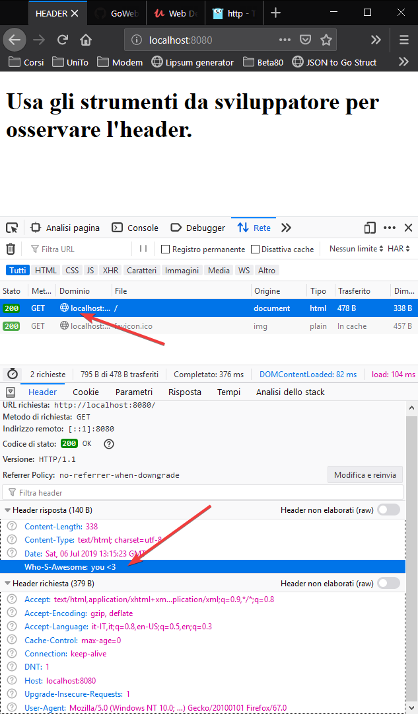

# Readme

## Response

ResponseWriter è un'interfaccia che permette all'handler di creare una risposta HTTP.

```Go
type ResponseWriter interface {
        Header() Header
        Write([]byte) (int, error)
        WriteHeader(statusCode int)
}
```

### Script

```Go
package main

import (
	"fmt"
	"html/template"
	"net/http"
)

// Handler is my handler for incoming connections
type Handler struct{}

func (h Handler) ServeHTTP(res http.ResponseWriter, req *http.Request) {
	res.Header().Add("who-s-awesome", "you <3")
	tpl.ExecuteTemplate(res, "template.gohtml", nil)
}

func init() {
	tpl = template.Must(template.New("").ParseGlob("template.gohtml"))
}

var tpl *template.Template

func main() {
	fmt.Println("Server listening on port 8080")
	var Handler Handler
	http.ListenAndServe(":8080", Handler)
}
```

### Template

```Gohtml
<!DOCTYPE html>
<html lang="en">
<head>
    <meta charset="UTF-8">
    <meta name="viewport" content="width=device-width, initial-scale=1.0">
    <meta http-equiv="X-UA-Compatible" content="ie=edge">
    <title>HEADER</title>
</head>
<body>
    <h1>Usa gli strumenti da sviluppatore per osservare l'header.</h1>
</body>
</html>
```

### Output

