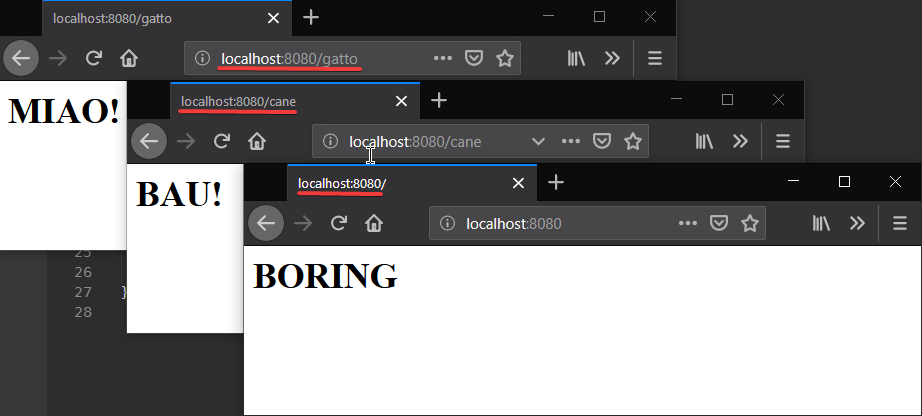

# readme

## Routing

Ci sono modi migliori di gestire le varie routes di questo:

## Script

```Go
package main

import (
	"fmt"
	"net/http"
)

// Handler my incoming connections handler
type Handler struct{}

func (h Handler) ServeHTTP(res http.ResponseWriter, req *http.Request) {
	switch req.URL.Path {
	case "/":
		fmt.Fprintln(res, "<h1>BORING</h1>")
	case "/cane":
		fmt.Fprintln(res, "<h1>BAU!</h1>")
	case "/gatto":
		fmt.Fprintln(res, "<h1>MIAO!</h1>")

	}
}

func main() {
	fmt.Println("server listening on port :8080")
	var handler Handler
	http.ListenAndServe(":8080", handler)
}
```

## Output

