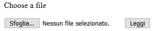
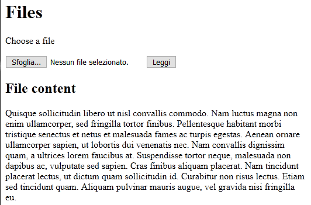

# read file

Un form in cui poter selezionare un file da inviare al server, tipo:



si crea in questo modo:

```gohtml
<p>Choose a file</p>

<form method="POST" enctype="multipart/form-data">
    <input type="file" name="ff" id="ff"> 💥
    <input type="submit" value="Leggi">
</form>
```

- Il metodo è `POST`
- `action` non è specificato: `action="/"`
- `<input type="file" name="ff" id="ff">` crea la casella di selezione del file
  - il file viene ricevuto come variabile di nome `ff` nel body della request

La **lettura del file** avviene usando `f, h, err := r.FormFile("ff")`.

```Go
f, h, err := r.FormFile("ff")
if err != nil {
    http.Error(w, err.Error(), http.StatusInternalServerError)
    return
}
defer f.Close()

fmt.Printf("File Header: %v\nFile content: %v\n", h, f) // FYI
```

## Esempio

### Output



### Template

```gohtml
<!DOCTYPE html>
<html lang="en">
<head>
    <meta charset="UTF-8">
    <meta name="viewport" content="width=device-width, initial-scale=1.0">
    <meta http-equiv="X-UA-Compatible" content="ie=edge">
    <title>Files</title>
</head>
<body>
    <h1>Files</h1>

    <p>Choose a file</p>

    <form method="POST" enctype="multipart/form-data">
        <input type="file" name="ff" id="ff">
        <input type="submit" value="Leggi">
    </form>

    {{if .}}
        <div>
            <h2>File content</h2>
            <p>
                {{.}}
            </p>
        </div>
    {{end}}
</body>
</html>
```

### Script

```Go
package main

import (
    "fmt"
    "html/template"
    "io/ioutil"
    "net/http"
)

func home(w http.ResponseWriter, r *http.Request) {
    if r.Method != http.MethodPost {
        tpl.Execute(w, nil)
        return
    }

    f, h, err := r.FormFile("ff")
    if err != nil {
        http.Error(w, err.Error(), http.StatusInternalServerError)
        return
    }
    defer f.Close()

    // FYI
    fmt.Printf("File Header: %v\nFile content: %v\n", h, f)

    b, err := ioutil.ReadAll(f)
    if err != nil {
        http.Error(w, err.Error(), http.StatusInternalServerError)
    }
    tpl.Execute(w, string(b))
}

func init() {
    tpl = template.Must(template.ParseFiles("templates/tpl.gohtml"))
}

var tpl *template.Template

func main() {
    fmt.Println("Listening on port :8080")

    http.HandleFunc("/", home)
    http.Handle("/favicon.ico", http.NotFoundHandler())

    http.ListenAndServe(":8080", nil)
}

```
