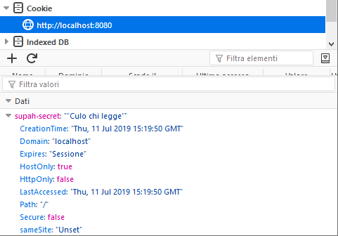

# Cookie

I cookie sono piccoli file che contengono informazioni che il server può scrivere nella macchina del client se il client permette la scrittura di cookie.

Ogni volta che il client del browser invia una richiesta ad un certo server/dominio se il browser trova cookie per quel dominio li aggiunge alla request.

Il server riceve una request nel quale può trovare informazioni (ad esempio id univoci) associati a quel determinato utente.

## Workaround

Se i cookie non sono abilitati nel client, una delle possibili azioni è quella di specificare un parametro ID nell'url e usare https. Il server userà quel parametro per capire con quale utente sta comunicando.

NB: **Il nome di un cookie NON PUO' contenere spazi**.

## Write cookies

### Script

```Go
package main

import (
    "fmt"
    "net/http"
)

func setMyCookie(w http.ResponseWriter, r *http.Request) {
    http.SetCookie(w, &http.Cookie{
        Name:  "supah-secret",
        Value: "Culo chi legge",
    })
    fmt.Fprintln(w, "Controlla i cookie.")
}

func main() {
    fmt.Println("Listening on port :8080")

    http.HandleFunc("/", setMyCookie)
    http.Handle("/favicon.ico", http.NotFoundHandler())

    http.ListenAndServe(":8080", nil)
}
```

### Output



## Read cookies

Per leggere i cookies ci sono due opzioni:

### 1.

Scorrere la lista di cookies ottenuta col metodo `(r *httpRequest) Cookies() []*http.Cookie`

```Go
// Cookies parses and returns the HTTP cookies sent with the request.
func (r *Request) Cookies() []*Cookie {
    return readCookies(r.Header, "")
}
```

### 2.

Ottenere direttamente il cookie voluto con func `(r *http.Request) Cookie(name string) (*http.Cookie, error)`


```Go
c, err := r.Cookie("myCookie")
if err != nil {
    fmt.Println("No cookie named 'myCookie'")
}
fmt.Fprintln(w, "Found 'myCookie': ", *c)
```

## Script

```Go

func readCookie(w http.ResponseWriter, r *http.Request) {
    for i, c := range r.Cookies() {
        fmt.Fprintln(w, i, *c)
    }

    c, err := r.Cookie("myCookie")
    if err != nil {
        fmt.Println("No cookie named 'myCookie'")
    }
    fmt.Fprintln(w, "Found 'myCookie': ", *c)
}
```
