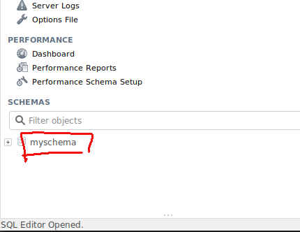

# MySQL

Per usare un database MySQL gia' creato e' necessario importare i package:

- `database/sql`
- `github.com/go-sql-driver/mysql`

che va prima installato con `go get -u github.com/go-sql-driver/mysql`.

```Go
import "database/sql"
import _ "github.com/go-sql-driver/mysql"

db, err := sql.Open("mysql", "user:password@/dbname")
```

Il package del driver viene importato con l'**alias vuoto `_`** perche' viene usato solo in fase di configurazione e mai all'interno del codice.

`Open` non apre la connessione, quindi per verificare che tutto sia andato a buon fine si usa:

```Go
func (c *Conn) PingContext(ctx context.Context) error
```

## Esempio

```Go
package main

import (
    "database/sql"
    "fmt"
    "log"
    "syscall"

    _ "github.com/go-sql-driver/mysql"
    "golang.org/x/crypto/ssh/terminal"
)

func main() {
    fmt.Println("Please enter DB password:")

    bytePassword, err := terminal.ReadPassword(int(syscall.Stdin))
    if err != nil {
        log.Fatal(err)
    }
    password := string(bytePassword)

    dbURL := fmt.Sprintf("root:%v@/myschema?charset=utf8", password) // OK
    // dbURL := fmt.Sprintf("root:%v@tcp(127.0.0.1:3306)/myschema?charset=utf8", password) 	// OK
    // dbURL := fmt.Sprintf("root:%v@tcp(localhost:3306)/myschema?charset=utf8", password) 	// OK
    db, err := sql.Open("mysql", dbURL)
    if err != nil {
        log.Fatalln(err)
    }
    defer db.Close()

    if err := db.Ping(); err != nil {
        log.Fatal(err)
    }
    fmt.Println("It's working")
}
```

Il package `"golang.org/x/crypto/ssh/terminal"` permette di far scrivere la password all'utente senza che venga stampata a video durante la digitazione.

NB: il nome del database da usare e' quello che in **MySQL workbench** si chiama `schema`:


