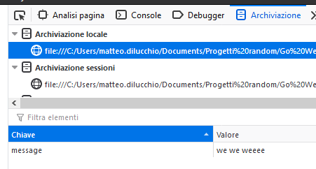

# web storage

E' un insieme di metodi per salvare dati sulla sessione di un utente alternativo ai cookie.

L'accesso a `local` e `session storage` avviene tramite `JavaScript`.

## local storage

Resiste anche alla chiusura del browser.

## session storage

Viene perso quando il browser viene chiuso.
